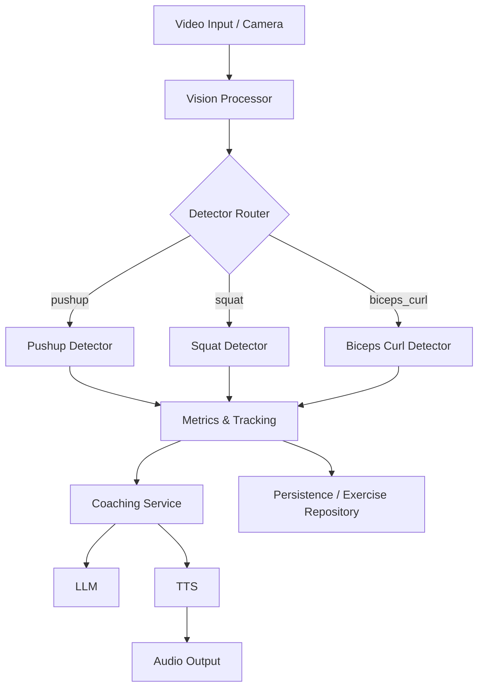

# 🏋️‍♂️ AI Realtime GYM Coach

> Realtime exercise detection, coaching prompts, and voice feedback using pose-landmarking and LLM-driven coaching.

---

## ✨ Project Overview

This repository provides a realtime (or near-realtime) exercise coaching pipeline that:
- captures pose/video input,
- runs detector modules for specific exercises,
- extracts metrics and tracks sets/reps,
- and provides coaching feedback via TTS and an LLM-based coach.

Core goals:
- Lightweight modular detectors for multiple exercises
- Pluggable services for voice, persistence, and LLM coaching
- Clear project structure so adding new detectors or models is easy

---

## 🧭 High-level Flow



This pipeline is implemented across `vision/`, `detectors/`, `services/`, and `state/`.

---

## 📂 Project Structure (key files)

- [main.py](main.py) — entry point to start the app.
- [requirements.txt](requirements.txt) — Python dependencies.
- [packages.txt](packages.txt) — additional packages (if used).
- [core/base_exercise.py](core/base_exercise.py) — abstract base for exercises.
- [detectors/](detectors/) — exercise detectors:
  - [detectors/pushup.py](detectors/pushup.py)
  - [detectors/squat.py](detectors/squat.py)
  - [detectors/biceps_curl.py](detectors/biceps_curl.py)
  - [detectors/lunges.py](detectors/lunges.py)
  - [detectors/shoulder_press.py](detectors/shoulder_press.py)
- [vision/exercise_video_processor.py](vision/exercise_video_processor.py) — handles frame input, preprocessing, and routing to detectors.
- [ml_models/pose_landmarker_full.task](ml_models/pose_landmarker_full.task) — pose-landmarker model (tracked here).
- [services/coaching/llm.py](services/coaching/llm.py) — LLM coaching orchestration.
- [services/coaching/tts.py](services/coaching/tts.py) — text-to-speech interface.
- [services/coaching/voice_pipeline.py](services/coaching/voice_pipeline.py) — audio pipeline glue.
- [services/persistence/exercise_repository.py](services/persistence/exercise_repository.py) — saving session/exercise data.
- [state/session_defaults.py](state/session_defaults.py) — default session settings.
- [static/style.css](static/style.css) — UI styling (if UI used).

---

## 🧩 Functionality Details

- Detectors: each detector module implements logic to inspect pose landmarks and determine repetitions, angles, and form issues.
- Vision Processor: reads frames (camera or video), runs pose-landmarker model from `ml_models/`, and dispatches normalized landmarks to detectors.
- Metrics: `services/tracking/metrics.py` collects per-exercise metrics (reps, tempo, range-of-motion).
- Coaching: `services/coaching/llm.py` composes prompts using recent metrics and requests feedback or encouragement from an LLM; `tts.py` speaks the LLM's response.
- Persistence: `services/persistence/exercise_repository.py` stores session progress and final metrics for later review.

---

## ▶️ Quickstart — Run Locally

1. Create a virtual environment (recommended) and activate it:

```bash
python -m venv .venv
.
# Windows PowerShell
.\.venv\Scripts\Activate.ps1
# Windows cmd
.\.venv\Scripts\activate.bat
```

2. Install dependencies:

```bash
pip install -r requirements.txt
```

3. Run the app (basic):

```bash
python main.py
```

Main flags (if implemented):
- `--source <camera|video|file>` — choose input source
- `--model <path>` — override default pose model

If `main.py` supports configuration via `config/workout_config.py` or environment variables, edit those before starting.

---

## 🔧 Development notes

- Add a new detector:
  1. Create `detectors/<your_exercise>.py` implementing the base class from [core/base_exercise.py](core/base_exercise.py).
  2. Update `vision/exercise_video_processor.py` to register your detector (or ensure detectors are auto-discovered).

- Tuning pose-landmarker: replace `ml_models/pose_landmarker_full.task` with a compatible file and update the loader in `vision/`.

---

## 🗣️ Coaching & Voice

- LLM prompts are composed in [services/coaching/llm.py](services/coaching/llm.py).
- TTS output flows through [services/coaching/tts.py](services/coaching/tts.py) and [services/coaching/voice_pipeline.py](services/coaching/voice_pipeline.py).

Notes:
- Keep LLM API keys and secrets out of source — prefer environment variables or an `auth` service.
- See [services/auth/login_wall.py](services/auth/login_wall.py) for auth-related components.

---

## 📈 Metrics & Persistence

- [services/tracking/metrics.py](services/tracking/metrics.py) computes trackers (rep counts, cadence, ROM).
- Results persist via [services/persistence/exercise_repository.py](services/persistence/exercise_repository.py).

---

## ✅ Checklist / Tips

- Ensure `ml_models/pose_landmarker_full.task` is present and compatible.
- Confirm camera permissions for the running platform.
- Use a small test video first to validate detector outputs.

---

## 🙋‍♂️ Want help extending this?
Open an issue or ask for help adding a new detector, improving prompts, or integrating a different TTS provider.

---

## 👥 Credits
- Built as a modular realtime coaching demo with clearly separated vision, detector, service, and persistence layers.

---

Happy training! 🏃‍♀️🏋️‍♀️
